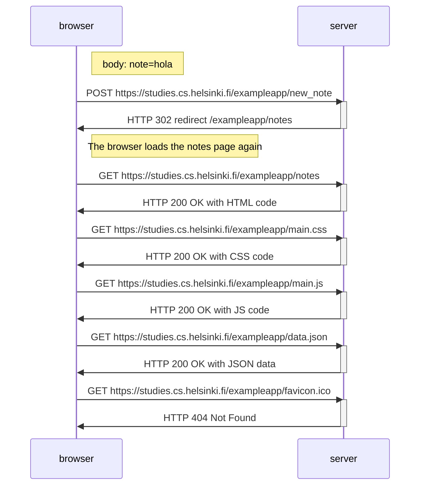

```mermaid
sequenceDiagram

    Note right of browser: body: note=hola
    browser->>server: POST https://studies.cs.helsinki.fi/exampleapp/new_note
    activate server
    server->>browser: HTTP 302 redirect /exampleapp/notes
    deactivate server

    Note right of browser: The browser loads the notes page again

    browser->>server: GET https://studies.cs.helsinki.fi/exampleapp/notes
    activate server
    server->>browser: HTTP 200 OK with HTML code
    deactivate server

    browser->>server: GET https://studies.cs.helsinki.fi/exampleapp/main.css
    activate server
    server->>browser: HTTP 200 OK with CSS code
    deactivate server

    browser->>server: GET https://studies.cs.helsinki.fi/exampleapp/main.js
    activate server
    server->>browser: HTTP 200 OK with JS code
    deactivate server

    browser->>server: GET https://studies.cs.helsinki.fi/exampleapp/data.json
    activate server
    server->>browser: HTTP 200 OK with JSON data
    deactivate server

    browser->>server: GET https://studies.cs.helsinki.fi/exampleapp/favicon.ico
    activate server
    server->>browser: HTTP 404 Not Found
    deactivate server
```
