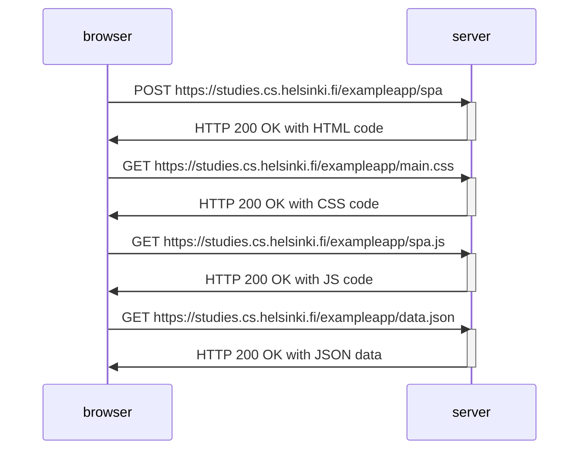

```mermaid
sequenceDiagram

    browser->>server: POST https://studies.cs.helsinki.fi/exampleapp/spa
    activate server
    server->>browser: HTTP 200 OK with HTML code
    deactivate server

    browser->>server: GET https://studies.cs.helsinki.fi/exampleapp/main.css
    activate server
    server->>browser: HTTP 200 OK with CSS code
    deactivate server

    browser->>server: GET https://studies.cs.helsinki.fi/exampleapp/spa.js
    activate server
    server->>browser: HTTP 200 OK with JS code
    deactivate server

    browser->>server: GET https://studies.cs.helsinki.fi/exampleapp/data.json
    activate server
    server->>browser: HTTP 200 OK with JSON data
    deactivate server
```
