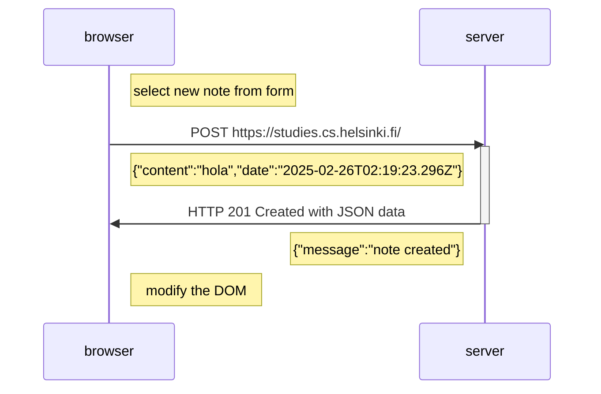

```mermaid
sequenceDiagram

   note right of browser: select new note from form
   browser->>server: POST https://studies.cs.helsinki.fi/
   activate server
   note right of browser: {"content":"hola","date":"2025-02-26T02:19:23.296Z"}
   server->>browser: HTTP 201 Created with JSON data
   deactivate server
   note left of server: {"message":"note created"}
   note right of browser: modify the DOM
```
